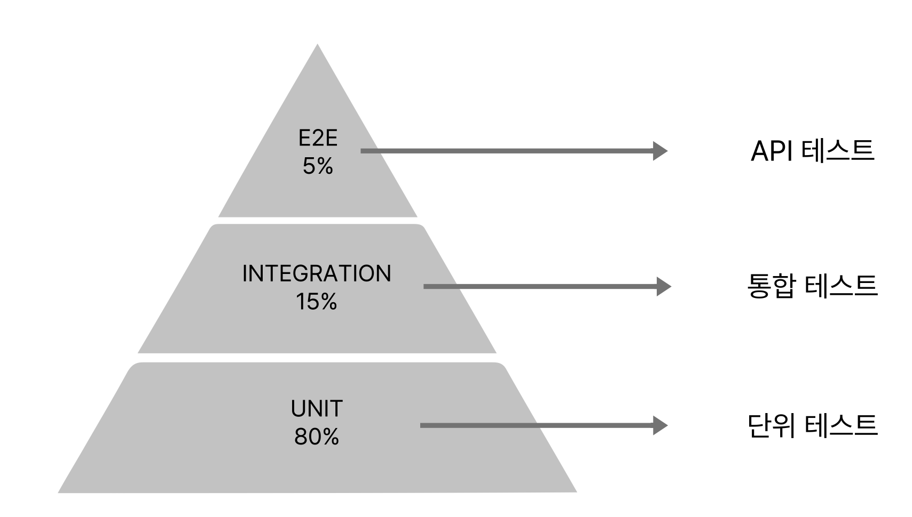
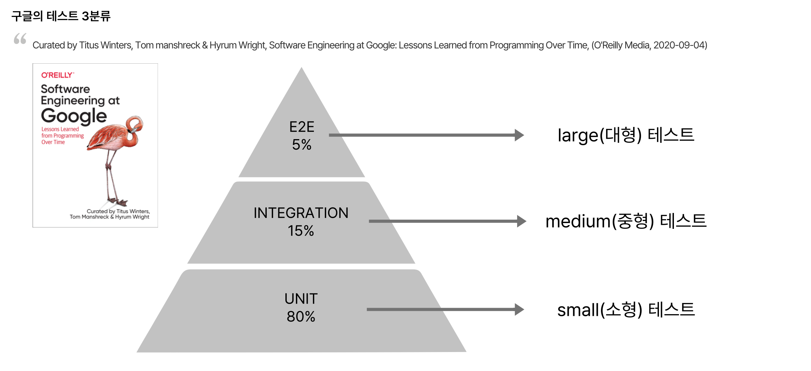
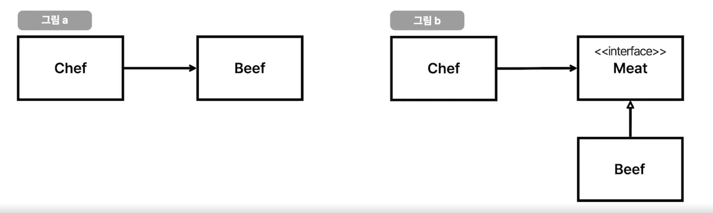
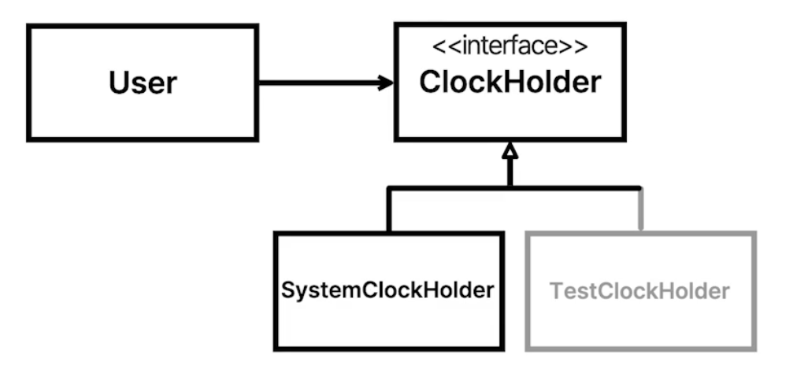

# Note

## 왜 내가 하는 TDD는 실패하는가?

### TDD 실패의 배경
> Regression bug (회귀 버그) : 잘 돌아가던 기능이었으나, 기존 코드를 수정하면서 생긴 버그

- 회귀 버그로 인해 신규 기능의 배포가 더뎌지고, 인수 테스트에 너무 많은 리소스가 필요해진다.
- 테스트는 소프트웨어 내적 품질을 높이는 것이지, 사용자가 체감하는 외적 품질을 높이는 것은 아니다.
  - 따라서 테스트의 당위성을 위해 커버리지를 높이겠다는 가시적 목표를 두고 테스트를 도입하는 실수를 하게 된다.
- 단순 커버리지를 높이기 위해 사소한 코드에도 모두 테스트를 추가하다보면 아래의 문제가 생긴다.
  - 속도 저하, 비결정적 (실행할때마다 결과 달라짐), 뭘 하는 테스트인지 의미 파악 어려움

### 무엇이 문제일까?

1. 레거시 코드에 테스트를 넣는게 TDD가 아니다. 개념을 혼동하지 말자.
2. 레거시에 테스트를 넣으려면 코드 개선이 필요하다.
   - 테스트의 목적은 (1) 회귀 버그 방지 (2) 유연한 설계로 개선하는 것이다.
      - 유연한 설계로 개선할 때
        - 테스트를 쉽게 만들 수 있고
        - 테스트를 결정적이게 만들어준다.
     - 테스트를 짜기 어렵다면 외부 시스템에 너무 의존하고 있을 가능성이 있다. 모킹이 아니라 코드 구조를 수정할 필요가 있다.
     - 단, 시스템에 회귀 테스트가 없을 확률이 높기에 회귀 버그 발생 가능성이 높아진다.
3. 커버리지에 집착하면 안된다.
   - 테스트를 추가했을 때 얻을 수 있는 효용성을 고민해야지, 커버리지에 집착하면 테스트의 장점을 얻기 힘들다.
   - 정말 테스트가 필요한 코드인지 고민해보자.

## 결론

커버리지를 올리기 위한 mock 프레임워크 사용법만 고민하는 게 아니라, 테스트를 해야 하는 이유, 어떻게 테스트를 해야하는지에 대한 고민이 필요하다.

### 테스트와 확장성을 동시에 지닌 서비스의 성장 방식

- 소형자 > 중형차 > 대형차 ... 가 아니라, 기차 후미에 새로운 호차를 추가하는 구조를 만들어야 한다.
  - 새로운 호차는 테스트가 완료된 호차여야 한다.
- 즉, TDD를 논하기 이전에 테스트가 가능한 구조로 변경하는 것이 먼저다.


### 테스트의 종류

- 인수테스트 : 사람이 직접 사용해 보면서 준비된 체크리스트를 체크한다
- 자동테스트 : 미리 짜여진 테스트 코드를 이용해 결과값과 예상값을 비교한다

### TDD

- 테스트 주도 개발
  - RED : 깨지는 테스트를 먼저 작성한다.
  - GREEN : 깨지는 테스트를 성공시킨다 (= 구현).
  - BLUD : 리팩토링한다.
- 장점 
  - 깨지는 테스트를 먼저 작성해야하기 때문에, 인터페이스를 먼저 만드는 것이 강제된다. 즉 구현체가 아닌 인터페이스에 집중하게 된다.
    - What/Who 사이클 : 어떤 행위를 누가 수행할 것인지 결정하는 과정
  - 대부분의 코드에 테스트가 작성되기 때문에, 장기적인 관점에서 개발 비용이 감소한다. 
- 단점
  - 초기 개발 비용이 크다. 피처 하나를 개발하는데 드는 부담감이 크다.
  - 난이도가 높다. 따라서 구성원의 숙련도가 반드시 뒷받침되어야 한다.

### 개발자의 고민

- 무의미한 테스트 (Recap)
  - 모든 메서드를 테스트하는 것보단, 중요한 로직을 잘 구분해서 해당 코드에 테스트를 넣어야 하지 않을까?
- 느리고 쉽게 깨지는 테스트
- 테스트가 불가한 코드
  - e.g., 사용자가 마지막으로 로그인했을 때의 시간을 확인해야 하는 경우 => mock을 통해 해결하기보다, 설계를 수정해야 하는 코드!

## 테스트의 필요성

- 레거시 코드
  - 마이클 C. 페더스 : 레거시 코드는 단순히 테스트 루틴이 없는 코드다. 
  - 어제 짠 코드가 오늘 봤을 때 좋지 않아 보이는 상황도 있음! 시간과 무관하게, 바로 어제 짠 코드라도 테스트가 없다면 레거시 아닐까?
- Regression
  - 정상적으로 동작하던 서비스가 배포로 인해 동작하지 않는 상황
  - 구글 웹 서버도 비슷한 이슈가 있었으나, 자동 테스트를 도입하며 배포 자신감이 높아지고 생산성이 높아짐.
  - 불안함을 시스템으로 해결하는 시도가 필요
- 좋은 아키텍처 유도
  - 나쁜 아키텍처와 테스트가 없는 코드는 피처 개발 부담감을 높인다.
  - SOLID 원칙을 지키면 경계가 만들어지고, 이가 Regression을 방지한다. SOLID를 지키는 테스트를 짜보자.

    
### SOLID와 테스트

> 테스트가 SOLID를 강제하는 것은 아니다. 테스트를 짜며 아래를 고려해야 한다.

1. S (단일 책임 원칙) : 테스트는 명료하고 간단하게 작성해야 하기에 단일 책임 원칙을 지키게 된다. 
    - 테스트가 너무 많아져서 이게 무슨 목적의 클래스인지 눈에 안들어온다면? => 클래스를 분할 (책임 분배)해야 하는 시점!
2. O (개방 폐쇄 원칙) : 테스트 컴포넌트와 프로덕션 컴포넌트를 나눠 작업하고, 필요에 따라 이 컴포넌트를 탈부착 가능하게 개발하게 된다.
3. L (리스코프 치환 원칙) : 이상적으로 모든 테스트는 모든 케이스에 대해 커버하고 있기에, 서브 클래스에 대한 치환 여부를 테스트가 판단해준다.
4. I (인터페이스 분리 원칙) : 테스트는 그 자체로 인터페이스를 직접 사용해볼 수 있는 환경이기에, 불필요한 의존성을 실제로 확인할 수 있는 샌드박스다.
   - 인터페이스가 너무 많아서 뭘 호출해야 할 지 모르겠다면? 인터페이스를 분리할 시점
5. D (의존성 역전 원칙) : 가짜 객체를 이용해 테스트를 작성하려면 의존성이 역전되어 있어야 하는 경우가 생긴다.

> 테스트를 넣으려고 한 이유가 회귀 버그를 방지하기 위함인지, 좋은 설계를 위함인지 고민하며 테스트 코드를 작성해야 한다.


## 테스트 3분류

### 전통적인 테스트 3분류 



- 정의가 모호하다.

### 구글의 테스트 3분류



- 소형 테스트 : 항상 결과가 결정적이고 속도가 빠르다. 이게 제일 많을 수록 좋음!
  - 단일 서버 / 단일 프로세스 / 단일 스레드에서 돌아가는 테스트
  - 디스크 I/O 사용해선 안됨
  - Blocking call 허용 안됨
  - e.g., Thread.sleep이 있으면 소형 테스트가 아니다.
- 중형 테스트 : 결과가 항상 같다고 보장할 수 없다.
  - 단일 서버 / 멀티 프로세스 / 멀티 스레드
  - e.g., h2와 같은 테스트 DB를 사용할 수 있다.
- 대형 테스트
  - 멀티 서버 / End to end 테스트

> 소형 테스트를 늘릴 수 있는 환경을 만들고 소형 테스트로 커버리지를 높여야 한다.

## 테스트에 필요한 개념

| 개념                           | 의미                                                                                   |
|------------------------------|--------------------------------------------------------------------------------------|
| SUT                          | System under test. 테스트 하려는 대상                                                        |
| BDD                          | Behaviour driven development (given - when - then) 언제 어떤 행동을 하면 이렇게 된다. 즉, 행동에 집중하자. |
| 상호 작용 테스트 (Interaction test) | 대상 함수의 구현을 호출하지 않으면서 그 함수가 어떻게 호출되는지를 검증하는 기법. 메서드가 실제로 호출되었는지를 검증하기에 캡슐화에 위배됨.      |
| 상태 검증                        | 어떤 값을 시스템에 넣었을 때 나오는 결과값을 기대값과 비교하는 방식                                               |
| 행위 검증                        | 상호 작용 테스트. 어떤 값을 시스템에 넣었을 때 협력 객체의 어떤 메서드를 실행하는가? BDD와 다름 주의                         |
| 텍스트 픽스처                      | 테스트할 때 필요한 자원을 미리 만들어두는 행위. (e.g., @BeforeEach를 이용해 만드는 자원 등)                        |
| 비욘세 규칙                       | 유지하고 싶은 상태나 정책이 있다면 알아서 정책을 만들어야 한다. 상태를 유지하고 싶었으면 테스트를 만들었어야지!                      |
| Testability                  | 소프트웨어가 테스트 가능한 구조인가?                                                                 |

### Test Double (테스트 대역)

- 실제로 실행하면 안되는 경우 가짜 객체인 대역을 이용해 테스트하는 것
  - e.g., 이메일 발송을 테스트할 때, 진짜로 이메일이 나가면 안된다.

| 개념    | 의미                                                                                       |
|-------|------------------------------------------------------------------------------------------|
| Dummy | 아무런 동작도 하지 않고, 그저 코드가 정상적으로 돌아가기 위해 전달하는 객체                                              |
| fake  | Local에서 사용하거나 테스트에서 사용하기 위해 만들어진 가짜 객체. 자체적인 로직이 있다.                                     |
| stub  | 미리 준비된 값을 출력하는 객체. 보통 mockito 프레임워크를 활용한다.                                               |
| mock  | 메서드 호출을 확인하기 위한 객체. 자가 검증 능력을 갖춤. 단순히 어떤 행위가 제대로 호출되었는지 확인하는 객체로, 사실상 테스트 더블과 동일한 의미로 사용 |
| spy   | 모든 메소드 호출을 전부 기록했다가 나중에 확인하기 위한 객체. 메서드가 몇 번 호출되었는지, 잘 호출되었는지 등등을 기록해서 검증에 사용한다.         |


## 의존성과 Testability

### 의존성

- 의존성 (Dependency) : 결합(coupling)과 동일한 개념. 다른 객체의 함수를 사용하는 상태.
- 의존성 주입 (Dependency Injection) : 필요한 값을 직접 인스턴스화하는게 아니라, 외부에서 넣어주는 것. 의존성을 약화시키는 테크닉
  - 단, 의존성 주입이 모든 의존성을 없애는 것은 아니다. 단순히 약화시킬 뿐!
  - 의존성 제거 = 객체간 협력 부정 = 시스템간 협력 부정
  - 디자인 패턴, 설계 등은 의존성을 약화시키는 고민에 대한 결과물이지 없애는 것이 아니라는 것 주의

> 인스턴스를 만드는 것보다 의존성을 주입하는게 더 좋은 이유는? = new가 하드 코딩이기 때문!



> Chef가 Beef를 직접 호출하는게 아니라, 인터페이스 Meat를 통해 Beef와 통신하는 구조. 즉 인터페이스와 구현을 분리해 의존성을 역전시킴

- 의존성 역전 (Dependency Inversion Principal / SOLID-DIP) 
  - 상위 모듈은 하위 모듈에 의존하면 안된다. 상위 모듈과 하위 모듈 모두 추상화에 의존해야 한다.
  - 추상화는 세부 사항에 의존해선 안된다. 세부사항이 추상화에 의존해야 한다.

> 로버트 C. 마틴 <br>
> - 고수준 정책을 구현하는 코드는 저수준 세부사항을 구현하는 코드에 절대로 의존해선 안된다. 세부사항이 정책에 의존해야 한다. <br>
> - 자바와 같은 정적 타입 언어에서 이 말은, use, import, include 구문은 오직 인터페이스나 추상 클래스 같은 추상적인 선언만을 참조해야 한다는 뜻이다. <br>
> - 우리가 의존하지 않도록 피하고자 하는 것은 바로 변동성이 큰 구체적인 요소이다.

### 의존성과 테스트

> 테스트를 잘 하려면 의존성 주입과 의존성 역전을 잘 다룰 수 있어야 한다.

```java
import java.time.Clock;

class User {

  private long lastLoginTimestamp;

  public void login() {
    // ...
    this.lastLoginTimestamp = Clock.systemUTC().millis()
  }

}

user.login()
```

- 의존성이 숨겨진 상황
  - User 내부 로직을 보면 login은 Clock에 의존적이다.
  - 하지만 외부에서 user.login()만 보면 로그인이 시간에 의존하고 있는지 알 수 없다.

```java
class UserTest {
    
    @Test
    public void login_테스트() {
        // given
        User user = new User();
        
        // when
        user.login();
        
        // then
        assertThat(user.getLastLoginTimestamp()).isEqualTo(????);
    }
}
```

- 의존성이 숨겨지면 테스트할 수 있는 수단이 사라진다.
  - 라이브러리를 사용할 수도 있겠으나, 라이브러리 없이 테스트할 수 없는 것은 부자연스럽다.
- 테스트를 짜다가 '테스트가 불가능한데?', '특정 라이브러리나 프레임워크 없인 테스트가 불가능하겠는데?' 싶다면 코드를 수정해야 할 타이밍.

```java
import java.time.Instant;

class User {

  private long lastLoginTimestamp;

  public void login(Clock clock) {
    // ...
    this.lastLoginTimestamp = clock.millis();
  }
}

class UserTest {

  @Test
  public void login_테스트() {
    // given
    User user = new User();
    Clock clock = Clock.fixed(Instant.parse("2000-01-01T00:00:00.00Z"));

    // when
    user.login();

    // then
    assertThat(user.getLastLoginTimestamp()).isEqualTo(9272878791839819L);
  }
}
```

- 시간을 의존성 주입으로 해결해서 의존성을 드러내면 테스트할 수 있게 변한다.

```java
import java.time.Clock;

class UserService {

  public void login(User user) {
    // ...
    user.login(Clock.systemUTC());
  }
}

class UserServiceTest {
    @Test
    public void login_테스트() {
      // given
      User user = new User();
      UserService userService = new UserService();

      // when
      userService.login(user);

      // then
      assertThat(user.getLastLoginTimestamp()).isEqualTo(???);
    }
}
```

- 단 위와 같은 코드가 있다면 또 다시 문제 발생.
  - 의존성 주입은 폭탄을 넘겨줬을 뿐, 결국 어딘가에선 고정된 값을 넣어주어야 한다는 점에 주의하자.
- 이런 코드는 의존성 주입 + 의존성 역전으로 해결해야 한다.

```java
import java.time.Clock;

interface ClockHolder {

  long getMillis();
}

@Getter
class User {

  private long lastLoginTimestamp;

  public void login(ClockHolder clockHolder) {
    // ...
    this.lastLoginTimestamp = clockHolder.getMillis();
  }
}

@Service
@RequiredArgsConstructor
class UserService {

  private final ClockHolder clockHolder;

  public void login(User user) {
    // ...
    user.login(clockHolder);
  }
}

@Component
class SystemClockHolder implements ClockHolder {

  @Override
  public long getMillis() {
    return Clock.systemUTC().millis();
  }
}

@AllArgsConstructor
class TestClockHolder implements ClockHolder {
    
    private Clock clock;

  @Override
  public long getMillis() {
    return clock.millis();
  }
}
```



- 이제 User는 ClockHolder에 의존하고, ClockHolder는 외부에서 주입받으며, ClockHolder은 UserService가 멤버로 들고있다.
- ClockHolder의 구현체를 두개 만든다
  - SystemClockHolder은 실제 배포할 때 사용하는 것. @Component가 있기에, 스프링 빈으로 등록되어 알아서 스프링이 주입해준다.
  - TestClockHolder은 테스트할 때 사용하는 것으로, 객체를 만들 때 Clock을 받고 현재 시간은 건네받은 clock을 사용한다.

```java
import java.time.Clock;
import java.time.Instant;
import java.time.ZoneId;

class UserServiceTest {

  @Test
  public void login_테스트() {
    // given
    Clock clock = Clock.fixed(Instant.parse("2000-01-01T00:00:00:00Z"), ZoneId.of("UTC"));
    User user = new User();
    UserService userService = new UserService(new TestClockHolder(clock));

    // when
    userService.login(user);

    // then
    assertThat(user.getLastLoginTimestamp()).isEqualTo(9738389400000L);
  }
}
```

- 이제 우리가 정한 Clock만 이용하는 일관적인 테스트를 만들 수 있다!
- 이처럼 대부분의 소프트웨어 문제는 의존성 역전으로 해결 가능하다.

### Testability

- 테스트 가능성 : 얼마나 쉽게 input을 변경하고, output을 쉽게 검증할 수 있는가?
  - 감춰진 의존성 : 호출자는 모르는 입력이 존재하는 경우 -> input 변경이 어려워짐. mock을 활용해 static 메서드를 억지로 테스트할 수도 있겠으나.. 구조를 바꾸는게 좋을 것!
  - 하드 코딩 : 파일이 존재하지 않을 때를 테스트 할 수 없다
  - 외부 시스템 : 하드 코딩된 외부 시스템과 연동되어 있는 경우
    - e.g., WebClient, RestTemplate 등을 직접 stub하는게 맞는 행위일까?
  - 감춰진 결과 : 외부에서 결과를 볼 수 없는 경우 -> output을 검증하기 어렵다.
    - e.g., 콘솔 출력으로 결과를 확인하는 경우는 테스트에서 결과를 검증하기 어렵다.