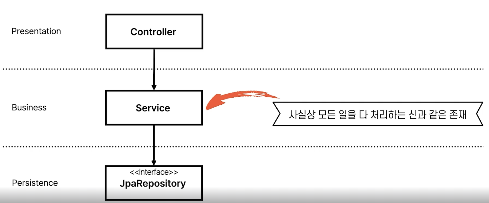
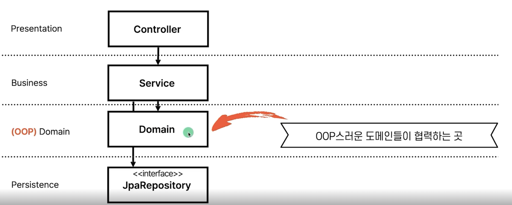
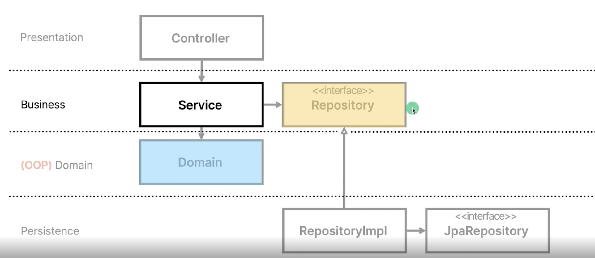
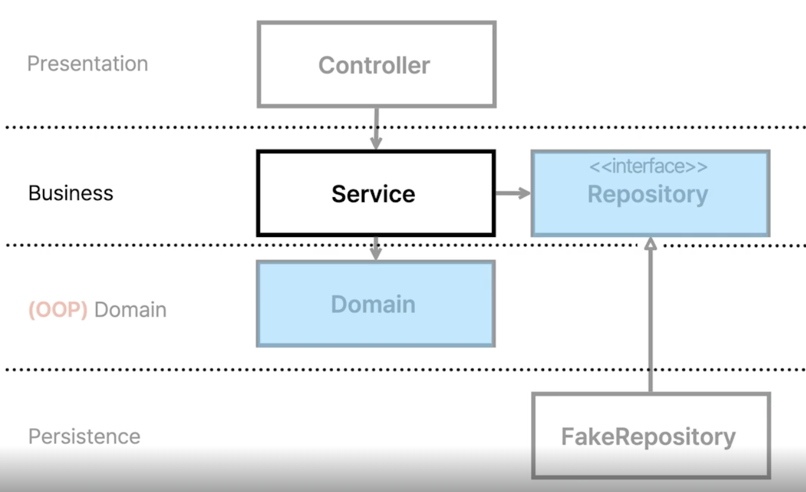
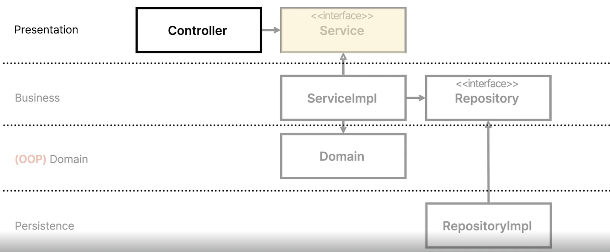
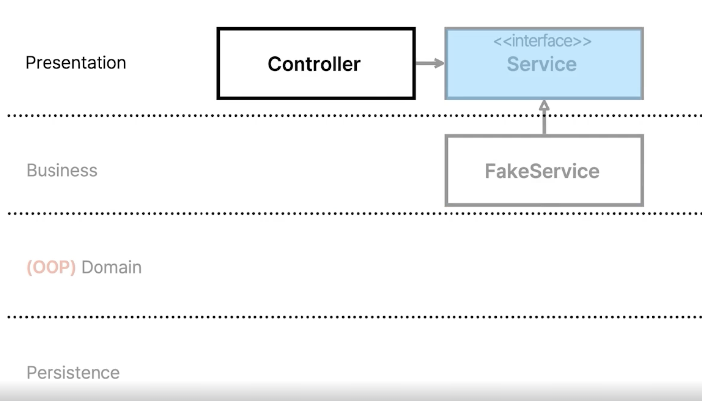
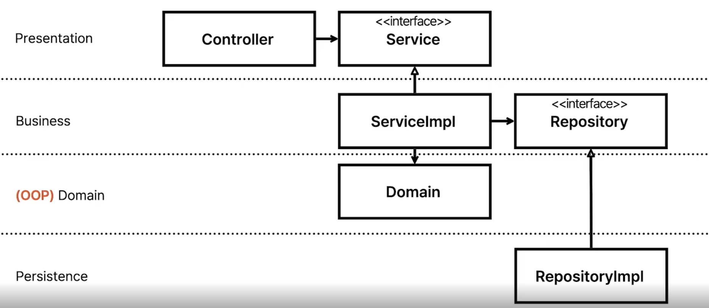
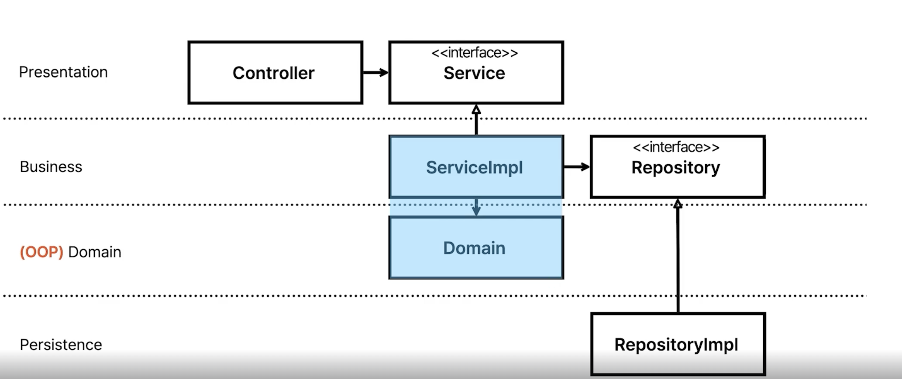

# 레이어드 아키텍처의 문제점과 해결책

- 레이어드 아키텍처
  - 유사한 기능들을 같은 계층으로 묶어 관리하는 방식의 아키텍처
  - 직관적이고 배우기 쉽기 때문에, 기능 개발을 할 때 가시적인 무언가를 만들기 가장 쉬운 아키텍처이다.

## 문제점

### h2로 인한 문제점

- 모든 테스트가 h2를 필요로 한다.
- 동시에 모든 테스트가 중형 테스트이므로, 테스트가 무겁다.

> 즉 설계가 잘못되었거나, 또는 지금 작성한 테스트가 실제 테스트가 필요한 본질이 아닐 확률이 있다.  
> e.g., ES처럼 embedded service가 없는 스택은 어떻게 테스트해?

### 레이어드 아키텍처로 인한 문제점

- 제일 아랫 단인 영속성 계층을 토대로, 즉 DB 주도 설계를 하게 된다.
  - 유스케이스를 먼저 파악하고, 이를 처리하기 위한 도메인과 도메인 사이의 관계를 먼저 고민해야 할 것!
- 동시 작업 문제가 발생한다. 특정 기능 개발을 동시에 한 명만 수행 가능하다. (절차 지향 코드의 단점이기도 함)
- 계층형 아키텍처는 업무 도메인에 대해 아무것도 말해주지 않으므로, 도메인이 죽게 된다.
   모든 객체가 getter, setter를 갖는 등 수동적이게 되며, 모든 코드는 함수 위주로 동작한다. (= fat service)

> 결국 레이어드 아키텍처는 절차 지향적 사고를 유도하고, 따라서 낮은 Testability와 Bad SOLID를 유발한다.

## 해결책 (변경 계획)

- Presentation 계층 (Controller)
  - 인스턴스화는 쉽지만 의존성이 3개나 된다! (Service, Domain, Repository)
- Business 계층 (Service)는 도메인을 Repository에서 가져와 책임을 위임하는 역할
  - 도메인 의존성 : 도메인은 순수 java 코드이므로, 인스턴스화 하는 것이 어렵지 않다 => 방해 요인 X
  - 영속성 의존성 : DB와 강결합된 JPA 코드라 인스턴스화 하는 것은 어렵다 => 의존성 역전으로 해결하자.
- Domain 계층은 OOP스러운 도메인들이 협력하는 곳. 즉, 실제 업무를 담당하는 곳
  - 도메인 모델을 lombok을 제외한 어노테이션이 없는 오브젝트로 만들어, 도메인과 영속성 계층을 분리하는 것이 필요!
  - 도메인 레이어와 다른 레이어간 연결된 의존성이 없기에 mocking을 할 필요가 없다 (POJO니까). 따라서 Testability가 높아짐
- Persistence (JpaRepository)도 계층간 연결된 의존성이 없어진다.
  - 근데 Repository의 테스트는 어차피 Jpa 쪽에서 잘 처리하고 있기에 굳이 테스트 할 필요는 없을 듯?

### Service-Persistence 계층 사이의 의존성을 약화 시키는 방법

- 비즈니스 계층에는 레포지토리의 인터페이스를 두고, 영속성 계층에는 인터페이스의 구현체를 둔다.

- 위 과정을 통해 테스트할 때 Fake를 사용해서 Testability를 높일 수 있다.
  - 만약 RDB를 사용하다가 NoSQL로 갈아타게 되더라도 구현체만 갈아치우면 되므로, 서비스 코드는 영향을 받지 않는다.

### 의존성이 많은 Controller의 Testability 높이는 방법

- 마찬가지로 presentation 계층에 service interface를 두는 방식으로, 테스트 할 때 Fake나 Mock을 Service 구현체로 두게 하는 방식으로 쉽게 테스트할 수 있다.

### 최종 개선된 아키텍처

> 의존성 역전을 통해 계층간 의존성을 약화시킨 버전

- 외부 시스템에 대한 의존성도 전부 Persistence와 같은 방식으로 구현 -> Persistence가 아니라 Infrastructure 계층으로 부르자.

# 테스트의 범위

## 집중해야 하는 테스트

- Controller, RepositoryImpl 는 프레임워크와 라이브러리들이 알아서 잘 해줄 것이다! 굳이 테스트 할 필요가 없음
  - Controller : 요청을 받고 내려주는 역할. 스프링 팀이 잘 해주고 있을 것
  - Repository 구현체 : 엔티티를 통해 CRUD를 테스트하는 것은 JPA, Hibernate 팀이 잘 해주고 있을 것

- 어플리케이션의 핵심은 Domain과 Service 구현체!
  - 즉, 여기를 테스트하는 것이 전체 어플리케이션을 테스트하기 위한 최소 조건이라고 생각하고 집중하자.

## 낮은 커버리지에 대한 걱정

- Jpa, Spring 테스트를 뺐더니 커버리지가 너무 낮다면?
  - 그만큼 도메인이 빈약하다는 의미! 오히려 서비스의 경쟁력을 의심해야 하는 문제
  - CRUD를 제외하면 도메인이 없다는 의미로도 확인할 수 있다. 이 경우 굳이 어플리케이션 테스트가 필요한지에 대해서도 고민해보자.